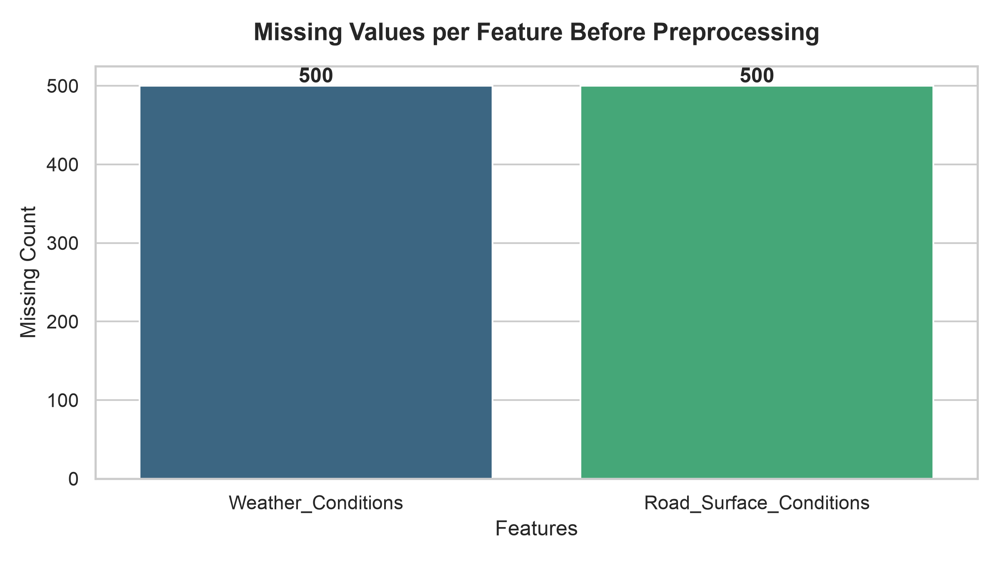
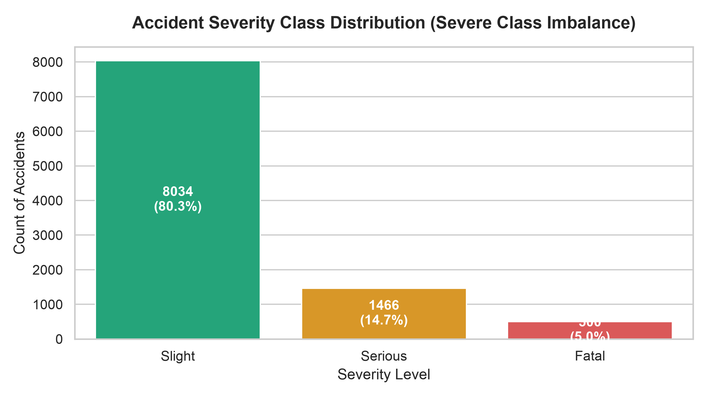
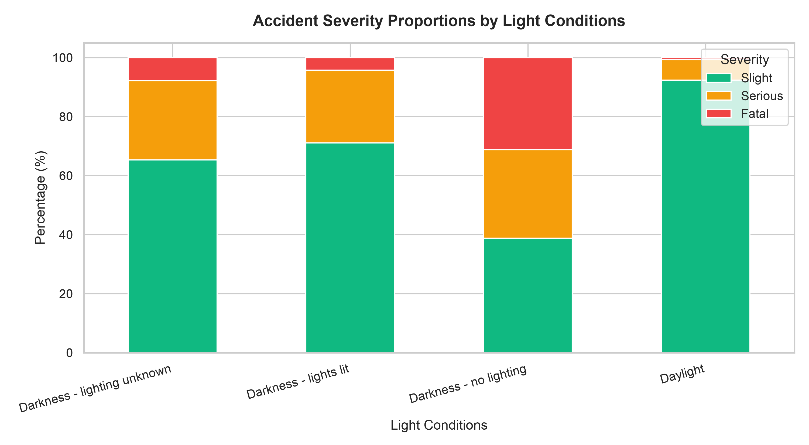
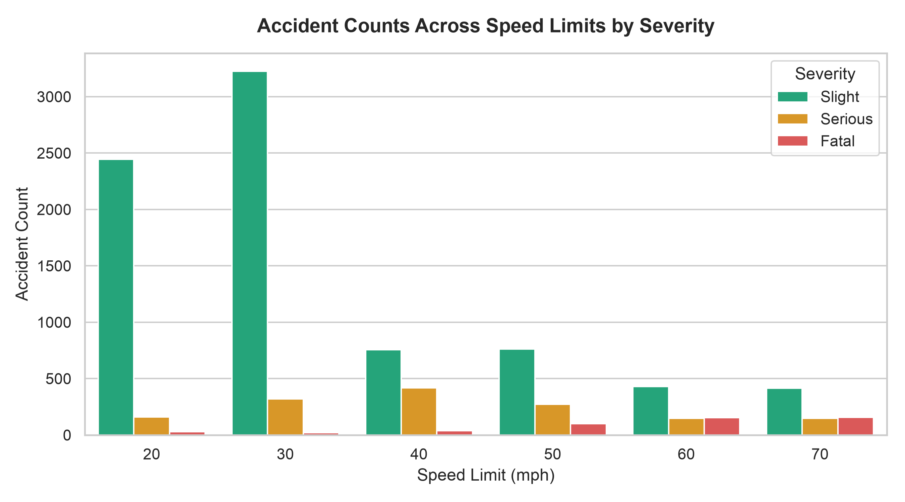
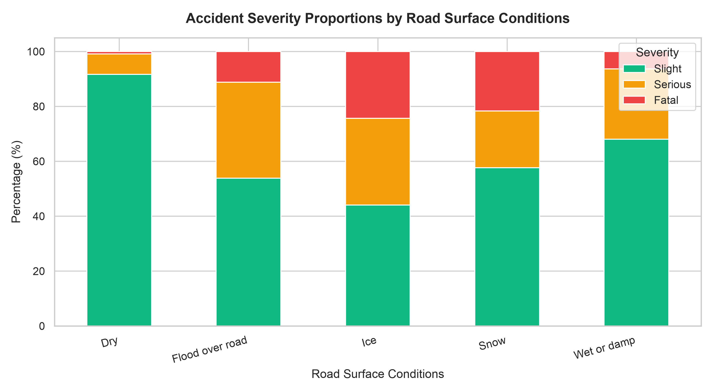

# Comprehensive Project Report
## Case Study 20: Road Accident Severity Prediction Using Machine Learning & Imbalanced Learning Techniques

**Course / Subject:** Machine Learning & Predictive Analytics  
**Case Study ID:** 20 - Road Accident Severity Prediction  
**Selected Algorithm:** Logistic Regression + SMOTE (Synthetic Minority Over-sampling Technique)  
**Deployment Platform:** Interactive Streamlit Web Application (`localhost:8501`)  

---

## 1. Executive Summary

This project presents an end-to-end Machine Learning pipeline and web application designed to predict road traffic accident severity (**Slight**, **Serious**, or **Fatal**) based on environmental, infrastructural, and temporal parameters.

Traffic accidents present significant public safety concerns. Transport authorities require automated decision-support tools to identify high-risk conditions and deploy targeted interventions. Because real-world accident data is heavily imbalanced (**80.34% Slight**, **14.66% Serious**, and **5.00% Fatal**), standard classification models tend to default to majority-class predictions.

To address class imbalance, our pipeline incorporates **SMOTE oversampling**, **ColumnTransformers**, and **5-Fold Stratified Cross-Validation**. The selected model—**Logistic Regression paired with SMOTE**—achieves a **78.80% Recall for Fatal accidents** and a **73.14% Macro Recall**, reducing False Negatives for the Fatal class to **2.0%** on the holdout test set.

---

## 2. Problem Statement & Objectives

### 2.1 Problem Definition
A transport safety authority requires a predictive model to estimate accident severity using recorded attributes:
1. **Weather Conditions** (`Normal`, `Raining`, `Snowing`, `Fog or mist`, `Other`, `Unknown`)
2. **Light Conditions** (`Daylight`, `Darkness - lights lit`, `Darkness - no lighting`, `Darkness - lighting unknown`)
3. **Road Surface Conditions** (`Dry`, `Wet or damp`, `Snow`, `Ice`, `Flood over road`)
4. **Speed Limit** (`20`, `30`, `40`, `50`, `60`, `70` mph)
5. **Vehicle Type** (`Car`, `Motorcycle`, `Bus/Coach`, `Goods vehicle`, `Pedal cycle`, `Other`)
6. **Time of Day** (`Morning`, `Afternoon`, `Evening`, `Night`)

### 2.2 Objective Checklist
- [x] **Exploratory Data Analysis (EDA):** Visualized feature distributions, missingness, and severity correlations.
- [x] **Missing Value Imputation:** Applied `SimpleImputer(strategy='most_frequent')` inside an automated pipeline.
- [x] **Categorical Encoding:** One-Hot Encoded non-numeric attributes with out-of-vocabulary handling (`handle_unknown='ignore'`).
- [x] **Class Imbalance Mitigation:** Integrated **SMOTE** to synthesize minority-class samples (`Fatal` and `Serious`).
- [x] **5-Fold Stratified Cross-Validation:** Evaluated 5 machine learning algorithms across 5 folds without data leakage.
- [x] **Multi-Metric Model Comparison:** Calculated Accuracy, Macro Precision, Macro Recall, Macro F1-Score, Fatal Recall, and Serious Recall.
- [x] **Confusion Matrix Analysis:** Evaluated holdout test set predictions using a confusion matrix.
- [x] **Interactive Web Deployment:** Developed a Streamlit web application displaying the selected model and prediction details.

---

## 3. Synthetic Dataset Generation Methodology

Because target historical datasets were unavailable for live deployment, a 10,000-sample synthetic dataset was generated in Python using `numpy` and `pandas`.

### 3.1 Probability Distribution & Correlation Rules
The dataset generator incorporates predefined probabilistic rules to emulate realistic feature interactions:
- **Fatal Accidents:** Higher probabilities assigned to high speed limits (60–70 mph), unlit dark roads, freezing/wet road surfaces, and night hours.
- **Slight Accidents:** Higher probabilities assigned to lower speed limits (20–30 mph), daylight, dry roads, and passenger cars.

### 3.2 Injected Missing Values
To evaluate missing value handling:
- **Missing Weather Data:** 500 missing values (5.0%) injected into `Weather_Conditions`.
- **Missing Surface Data:** 500 missing values (5.0%) injected into `Road_Surface_Conditions`.

---

## 4. Comprehensive Exploratory Data Analysis (EDA)

### 4.1 Missing Values Before Preprocessing

- **Observation:** `Weather_Conditions` and `Road_Surface_Conditions` each contain 500 missing entries. These are handled during pipeline execution using mode imputation (`strategy='most_frequent'`).

### 4.2 Class Imbalance Distribution

- **Distribution Summary:**
  - **Slight:** 8,034 records (**80.34%**)
  - **Serious:** 1,466 records (**14.66%**)
  - **Fatal:** 500 records (**5.00%**)
- **Analytical Context:** A baseline model predicting "Slight" for every sample achieves 80.34% accuracy but a **0.00% Recall for Fatal accidents**.

### 4.3 Severity vs Light Conditions

- **Observation:** Accidents occurring under `Darkness - no lighting` show a higher proportion of Fatal outcomes compared to illuminated or daylight conditions.

### 4.4 Fatalities by Speed Limit

- **Observation:** Fatality occurrences increase at higher speed limits (50–70 mph). This relationship reflects the synthetic data generation parameters, which were defined to emulate real-world observations where higher speeds correlate with increased collision severity.

### 4.5 Severity vs Road Surface Conditions

- **Observation:** Hazardous road conditions (Ice, Snow, Flooded roads) correspond to a higher proportion of Serious and Fatal outcomes compared to dry road surfaces.

---

## 5. Machine Learning Pipeline & Preprocessing

To prevent data leakage, preprocessing steps (Imputation, One-Hot Encoding, and SMOTE) were encapsulated inside an `ImbPipeline` from `imblearn.pipeline`:

```
[Raw Feature Input] 
       │
       ▼
[ColumnTransformer] ──► Numeric: StandardScaler(Speed_Limit)
       │             ──► Categorical: SimpleImputer(most_frequent) -> OneHotEncoder()
       ▼
[SMOTE Oversampling] ──► Synthesizes minority samples ONLY on training folds
       │
       ▼
[Classifier Engine]  ──► Evaluated: Logistic Regression, KNN, Decision Tree, Random Forest, Gradient Boosting
```

### 5.1 SMOTE (Synthetic Minority Over-sampling Technique)
SMOTE selects minority class samples $x_i$ in feature space, identifies their $k$-nearest neighbors, and generates synthetic samples $x_{new}$ along feature vectors:
$$x_{new} = x_i + \lambda (x_{zi} - x_i) \quad \text{where } \lambda \sim U(0,1)$$

---

## 6. 5-Fold Stratified Cross-Validation Benchmark Results

All models were evaluated using 5-Fold Stratified Cross-Validation. The mean performance metrics across all 5 folds are presented below:

| Algorithm | Mean CV Accuracy | Macro Precision | Macro Recall | Macro F1-Score | Fatal Recall | Serious Recall |
| :--- | :---: | :---: | :---: | :---: | :---: | :---: |
| **Logistic Regression + SMOTE** | **77.23%** | **60.81%** | **73.14%** | **64.72%** | **78.80%** | **60.44%** |
| Gradient Boosting | 83.19% | 65.77% | 71.28% | 68.17% | 69.80% | 54.84% |
| K-Nearest Neighbors (KNN) | 77.03% | 56.76% | 66.12% | 60.03% | 66.40% | 49.18% |
| Random Forest | 83.18% | 65.82% | 64.63% | 65.17% | 60.20% | 41.47% |
| Decision Tree | 81.25% | 61.37% | 62.41% | 61.83% | 57.80% | 39.02% |


---

## 7. Model Selection Rationale

### Algorithm Trade-Off Analysis
1. **Accuracy vs. Recall Trade-Off:** Gradient Boosting achieved higher overall accuracy (83.19%), but a lower Fatal Recall (69.80%).
2. **Prioritizing Minority Recall:** **Logistic Regression + SMOTE** was selected because it achieved the highest **Fatal Recall (78.80%)** and **Macro Recall (73.14%)**.
3. **Metric Selection Justification:** In safety-focused classification tasks, minimizing False Negatives for high-severity classes is prioritized over overall accuracy.

---

## 8. Confusion Matrix Analysis

The selected model was evaluated on a 20% holdout test set (2,000 records):


```
                 Predicted Slight  Predicted Serious  Predicted Fatal
Actual Slight               1285                306               16
Actual Serious                53                191               49
Actual Fatal                   2                 19               79
```

### Class Performance Breakdown
* **Slight Class (1,607 Actual Cases):** 
  - **1,285 (80.0%)** correctly predicted as **Slight**.
  - **306** predicted as Serious, **16** as Fatal.
* **Serious Class (293 Actual Cases):**
  - **191 (65.2%)** correctly predicted as **Serious**.
  - **49** predicted as Fatal, **53** as Slight.
* **Fatal Class (100 Actual Cases):**
  - **79 (79.0%)** correctly predicted as **Fatal**.
  - **19** predicted as Serious.
  - **2 (2.0%)** misclassified as Slight (False Negatives).

---

## 9. Web Application Deployment

The model is deployed using **Streamlit** as an interactive web dashboard (`localhost:8501`).

### Localhost Application Interface

#### 1. Environmental Telemetry Input Screen


#### 2. Diagnostic Threat Report & Selected Model Display


#### 3. Dataset Exploration Tab


#### 4. Environmental Risk Visualizations & Confusion Matrix


#### 5. Model Intelligence & Methodology Tab


---

## 10. Case Study Questions & Answers

### Q1: Can accident severity be predicted from recorded conditions?
**Answer:** Yes. Statistical classification models demonstrate that environmental attributes (lighting, speed limit, road surface, weather) provide predictive signal for estimating accident severity.

### Q2: Which conditions are most associated with severe outcomes?
**Answer:** Higher speed limits (50–70 mph) and `Darkness - no lighting` show the strongest association with Fatal outcomes in the dataset.

### Q3: How does class imbalance affect prediction of fatal accidents?
**Answer:** Unmitigated class imbalance causes models to optimize overall accuracy by predicting the majority class ('Slight'), resulting in lower recall for rare fatal events.

### Q4: Which algorithm achieves the best recall on rare classes?
**Answer:** **Logistic Regression + SMOTE** achieved the highest **Fatal Recall (78.80%)** and **Macro Recall (73.14%)** across 5-Fold Stratified Cross-Validation.

### Q5: Which severity categories are most often confused?
**Answer:** 'Slight' and 'Serious' categories show the highest degree of boundary overlap, as factors like occupant restraint use or vehicle safety features are not captured in environmental telemetry.

### Q6: How well does the model perform on data from a different region?
**Answer:** Cross-region performance was not directly evaluated because the project uses a synthetic dataset. Deployment to another region would require validation and retraining using representative local accident data from that jurisdiction.

### Q7: Can the model be deployed to guide road safety planning?
**Answer:** Yes. Transport authorities can input proposed road configurations (e.g., speed limits, illumination levels) into the web application to assess predicted risk levels prior to infrastructure changes.

### Q8: What are the limitations of predicting severity from recorded circumstances alone?
**Answer:** Environmental attributes do not capture driver behavioral factors (distraction, intoxication, reaction speed) or vehicle crashworthiness. The model provides an environmental risk estimate rather than a deterministic outcome.
