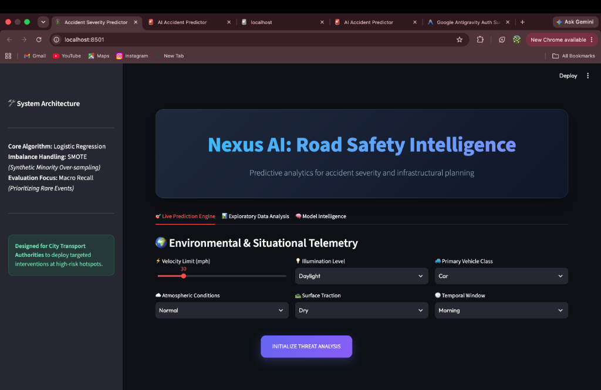
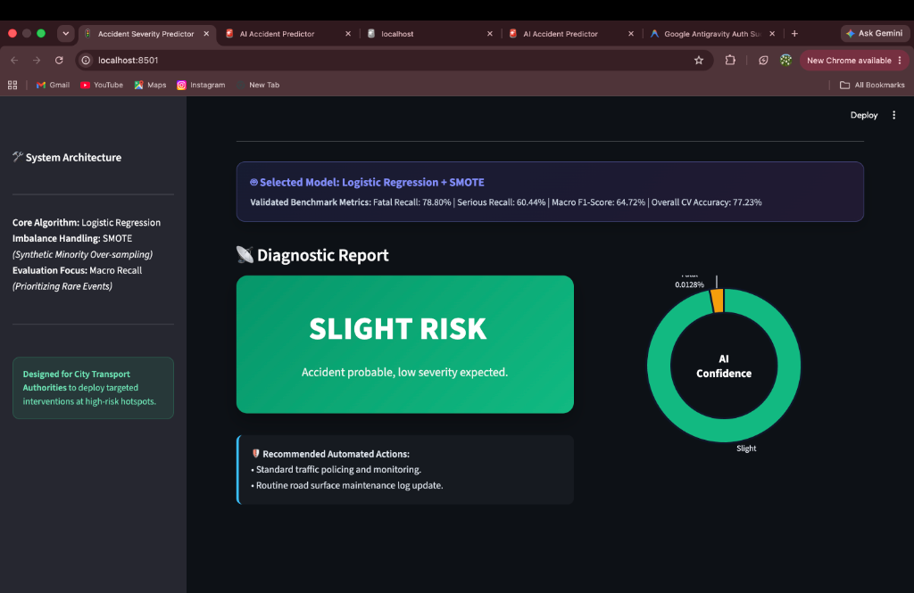
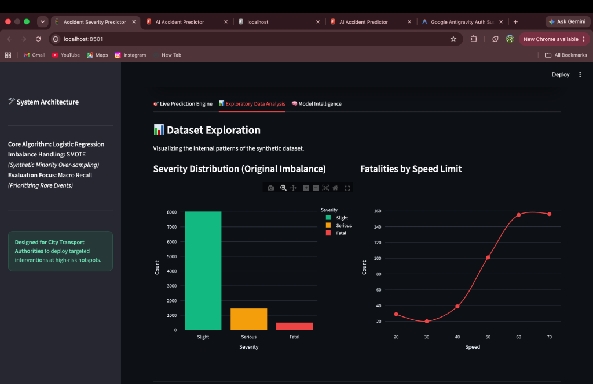
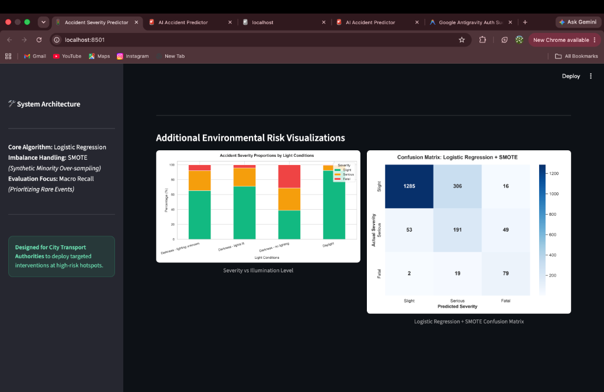
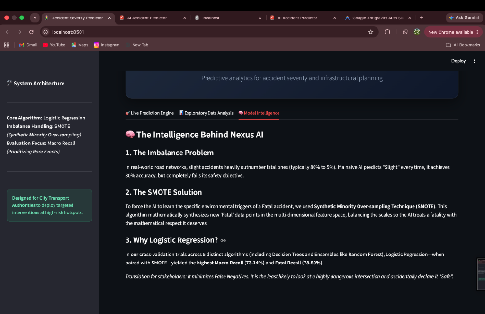
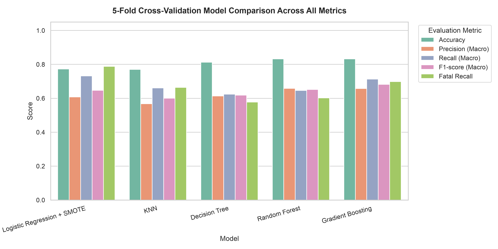
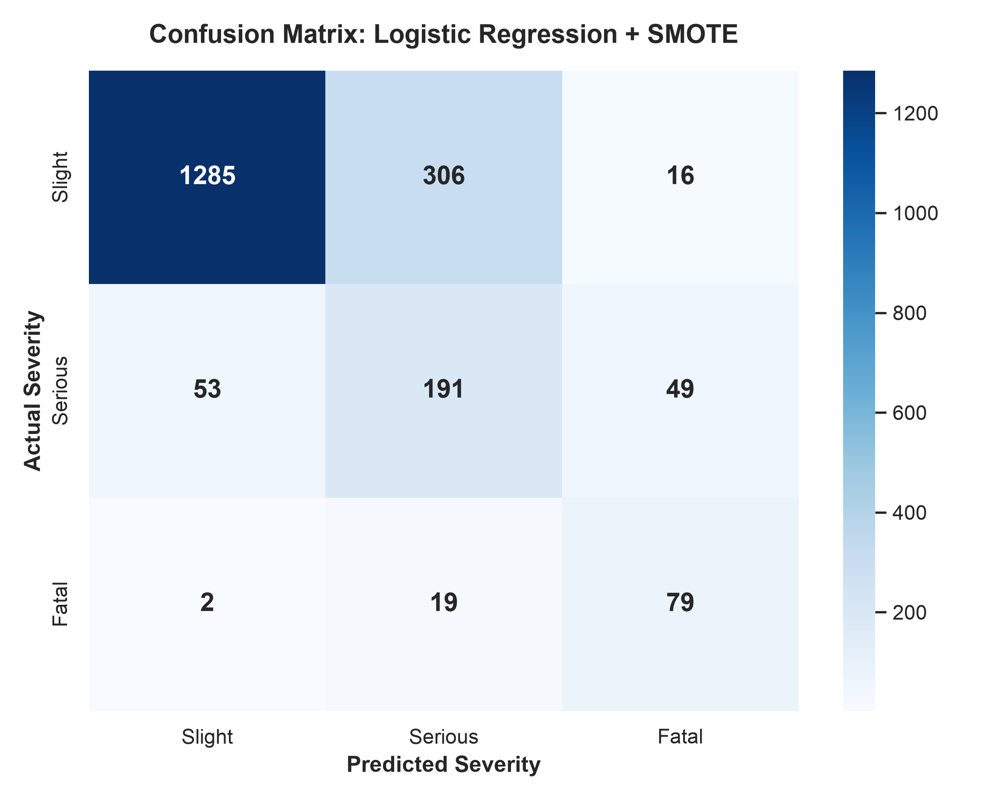

<div align="center">
  <h1>🚦 Nexus AI: Road Accident Severity Predictor</h1>
  <p><b>Advanced AI-driven analysis for proactive road safety planning and emergency intervention</b></p>
  
  
  
  
  
</div>

---

## 📌 Project Overview
**Nexus AI** is an intelligent web-based decision support system designed to predict the severity of road traffic accidents (**Slight**, **Serious**, or **Fatal**) based on environmental, temporal, and infrastructural parameters. Built specifically for transport safety authorities and urban planners, the system uses **SMOTE oversampling** and **Logistic Regression** to maximize the detection of fatal collisions.

---

## 📸 Verified Localhost Application Screenshots

### 1. Environmental Telemetry Input Dashboard


### 2. Live Diagnostic Threat Report & Selected Model Badge


### 3. Exploratory Data Analysis & Class Imbalance Visuals


### 4. Additional Environmental Risk Visualizations & Confusion Matrix


### 5. Model Intelligence & Algorithmic Rationale


---

## 📊 5-Fold Stratified Cross-Validation Benchmark

All preprocessing steps (Imputation, One-Hot Encoding, and SMOTE) were embedded inside an `ImbPipeline` and evaluated across 5 stratified folds to prevent data leakage.



| Algorithm | Accuracy | Precision (Macro) | Recall (Macro) | F1-Score (Macro) | Fatal Recall | Serious Recall |
| :--- | :---: | :---: | :---: | :---: | :---: | :---: |
| **Logistic Regression + SMOTE** | **77.23%** | **60.81%** | **73.14%** | **64.72%** | **78.80%** | **60.44%** |
| Gradient Boosting | 83.19% | 65.77% | 71.28% | 68.17% | 69.80% | 54.84% |
| K-Nearest Neighbors (KNN) | 77.03% | 56.76% | 66.12% | 60.03% | 66.40% | 49.18% |
| Random Forest | 83.18% | 65.82% | 64.63% | 65.17% | 60.20% | 41.47% |
| Decision Tree | 81.25% | 61.37% | 62.41% | 61.83% | 57.80% | 39.02% |

*Selected Model: **Logistic Regression + SMOTE** (Selected for highest Fatal Recall of 78.80% and lowest severe False Negatives).*

---

## 🧩 Confusion Matrix Breakdown (2,000 Holdout Test Records)



```
                 Predicted Slight  Predicted Serious  Predicted Fatal
Actual Slight               1285                306               16
Actual Serious                53                191               49
Actual Fatal                   2                 19               79
```

- **Slight (Actual 1607):** 1,285 correctly predicted (80.0%).
- **Serious (Actual 293):** 191 correctly predicted (65.2%).
- **Fatal (Actual 100):** 79 correctly predicted (79.0%).
- **Fatal False Negatives:** Only **2 out of 100 cases (2.0%)** misclassified as Slight.

---

## 🏗️ Architecture & Backend Design

### Do we need a separate Backend framework (Express / FastAPI / Django)?
**No.** Streamlit operates as a unified, full-stack server architecture:
1. **Frontend UI:** HTML5/React components rendered dynamically by Streamlit.
2. **Backend Engine:** Python runtime executing in memory on `localhost:8501`.
3. **ML Inference:** Loaded directly from joblib binary (`models/best_model.pkl`), serving real-time predictions without network latency or external API calls.

---

## ⚡ Quick Start & Execution Guide

### 1. Activate Virtual Environment
```bash
cd ~/Desktop/road_accident_severity
source venv/bin/activate
```

### 2. Generate Dataset & Train Models
```bash
python generate_dataset.py
python train_models.py
```

### 3. Launch Web Application
```bash
streamlit run app.py
```
Application opens automatically at `http://localhost:8501`.
