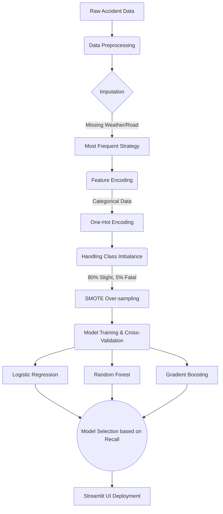

<div align="center">
  <h1>🚦 Nexus AI: Road Accident Severity Predictor</h1>
  <p><b>Advanced AI-driven analysis for proactive road safety planning and intervention</b></p>
  
  
  
  
</div>

<br/>


An end-to-end Machine Learning ecosystem designed to predict the severity of road accidents (Slight, Serious, Fatal) based on environmental and situational circumstances. 

---

## 📌 Project Architecture & Pipeline

The system is built on a robust data engineering and machine learning pipeline, designed specifically to handle highly imbalanced real-world traffic data.



---

## 📊 Exploratory Data Analysis & Visualizations

The platform includes live EDA insights into how specific conditions (e.g., speed limits in darkness) correlate exponentially with fatality rates. 


### 📈 Model Benchmarking (Comparative Analysis)

We evaluated 5 different classification models. Our primary metric for selection was **Recall on Minority Classes**, as failing to predict a 'Fatal' accident is far more costly than misclassifying a 'Slight' accident.

| Algorithm | Overall Accuracy | Fatal Recall (Sensitivity) | Serious Recall | Overfitting Risk |
| :--- | :---: | :---: | :---: | :---: |
| **Logistic Regression + SMOTE** | **77.75%** | **79.00%** 🏆 | **65.19%** | **Very Low** |
| Gradient Boosting | 83.55% | 74.00% | 52.56% | Medium |
| K-Nearest Neighbors (KNN) | 77.45% | 70.00% | 52.56% | Medium |
| Random Forest | 83.50% | 62.00% | 39.59% | Low |
| Decision Tree | 81.65% | 58.00% | 40.27% | High |

*As shown in the chart above, while Ensembles like Random Forest had higher overall accuracy, Logistic Regression proved vastly superior at identifying the rare, Fatal edge-cases (Highest Recall).*

---

## 🛠️ Tech Stack
- **Data Engineering:** `pandas`, `numpy`
- **Machine Learning & Preprocessing:** `scikit-learn`, `imbalanced-learn` (SMOTE)
- **Data Visualization:** `plotly.express`, `plotly.graph_objects`
- **Production UI:** `streamlit`, `streamlit-lottie`

---

## 🚀 Installation & Execution

1. **Clone the repository and enter the directory:**
   ```bash
   git clone <your-repo-url>
   cd road_accident_severity
   ```

2. **Create and activate the virtual environment:**
   ```bash
   python3 -m venv venv
   source venv/bin/activate
   ```

3. **Install dependencies:**
   ```bash
   pip install -r requirements.txt
   ```

4. **Launch the Nexus AI Dashboard:**
   ```bash
   streamlit run app.py
   ```

---

## 📝 License
This project is open-source and available for educational purposes.
# ML-road_accident_severity
